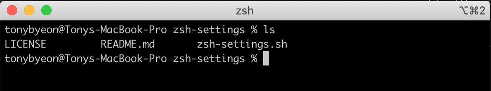
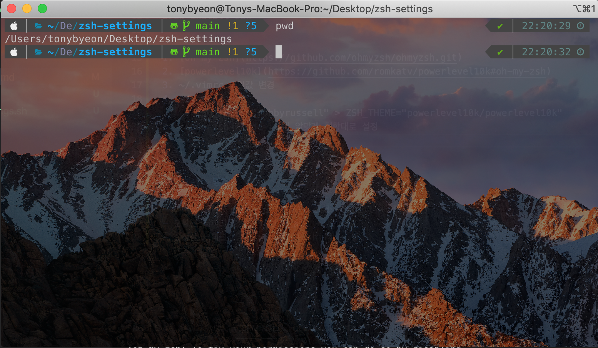

# zsh-settings
zsh-settings

순정 터미널... 뭔가 불편하다...  

  

쓰기 편하게 고쳐보자.  



> zsh 정도는 있다고 가정! 없다면
```
brew install zsh
```

1. [Oh my zsh](https://github.com/ohmyzsh/ohmyzsh.git)  
2. [powerlevel10k](https://github.com/romkatv/powerlevel10k#oh-my-zsh)  
3. ~/.vimrc 파일값 변경
4. ~/.zshrc
    - ZSH_THEME="robbyrussell" > ZSH_THEME="powerlevel10k/powerlevel10k"
5. <code>zsh</code> 후에 알맞게 취향대로 설정
6. terminal setting에서 배경과 투명도도 조절 할 수 있다.

끄읏!

## iTerm 명령어

- 터미널 분할: cmd + d (가로), cmd + shift + d (세로)
- 분활된 터미널 이동: cmd + alt + arrow
- 설정한 터미널값 저장: ctrl + shift + s